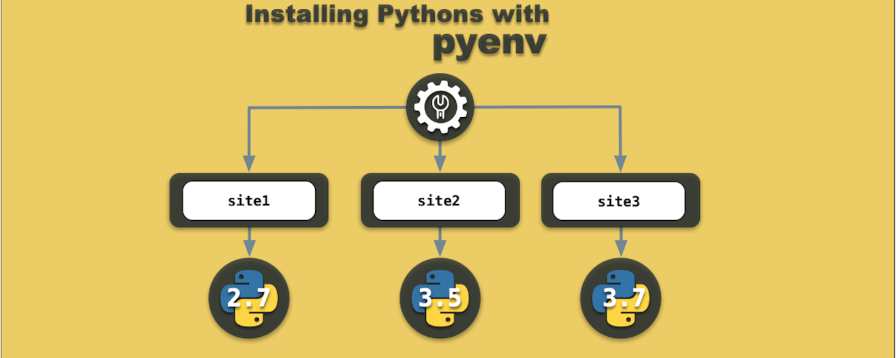

Title: Pyenv | Múltiplas versões python
Date: 03-01-2021
Tags: python, programação, desenvolvimento, software
Category: Python
Author: Mário N Jhúnior
Slug: pyenv-multiplas-versoes-python
Status: published

# pyenv?
### O que? Como? Pra que?  

  

Toda necessidade surge de um problema. Pelo menos é assim onde eu trabalho. E o nosso problema é gerenciar vários sites, ou projetos, onde cada um tem a necessidade de usar versões do python diferentes (vide imagem).  

Portanto, quando alguns dos projetos no qual trabalho em python começou a apresentar problemas após algumas atualizações de distros (distribuições=sistemas operacionais) linux, comecei a buscar soluções, daí surgiu um nome que até então não conhecia – pyenv.  

Para esse post não ficar maçante e cansativo, abordarei quatro pontos:  

1. O que é?
2. Porque usar?
3. Instalação
4. Como usar  

## O que é pyenv?

Sem delongas, pyenv é um poderoso gerenciador de versões do python. Trocando em miúdos, pyenv te permite de maneira simples e fácil instalar diversas versões do python e alternar entre elas, criar vários ambientes virtuais de cada versão.

De fato ele é simples e fácil. Faz o seu trabalho muito bem.

## Porque usar?
Imagine que você tem uma distribuição linux que por default vem com o python 3.8.5 e por algum motivo você precisa instalar a versão 3.6.6 do python, porque o pacote principal do seu projeto não foi atualizado para a versão atual, até o momento, do python. Ou porque, como já aconteceu comigo, no Raspberry Pi, as libs só eram funcionais no raspberry até a versão 3.7.2 do python.

Por um motivo ou outro você precisa instalar uma versão diferente do python. Projeto rodando e depois de atualizações dos pacotes do sistema operacional o projeto parou.

O que quero dizer é que usar o python do sistema é um passo arriscado. Além de que outras partes do sistema operacional usam o python massivamente, o que torna ainda mais perigoso. O que fazer então? Usar o pyenv para baixar de forma isolada as versões do python que você necessita e trabalhar despreocupado sem risco de quebrar seu sistema operacional ou de uma possível atualização quebrar o seu projeto. Então vamos ao pyenv!!!

## Instalação.
Atenção: essa forma de instalação foi testada apenas em distribuições linux.

A forma recomendada e na minha vivência a mais fácil foi executando no meu shell o comando abaixo.

    curl https://pyenv.run | bash

O comando acima instalará o pyenv junto com os plugins abaixo:

    pyenv: O pyenv aplicativo real
    pyenv-virtualenv: Plugin para pyenv ambientes virtuais
    pyenv-update: Plugin para atualização pyenv
    pyenv-doctor: Plugin para verificar se as pyenv dependências de compilação estão instaladas
    pyenv-which-ext: Plug-in para pesquisar comandos do sistema automaticamente

No final da execução do script será mostrada as instruções abaixo:

    WARNING: seems you still have not added 'pyenv' to the load path.
 
    # Load pyenv automatically by adding
    # the following to ~/.bashrc:
 
    export PATH="$HOME/.pyenv/bin:$PATH"
    eval "$(pyenv init -)"
    eval "$(pyenv virtualenv-init -)"

Adicione as três últimas linhas da instrução nos arquivos abaixo a depender do shell que estiver usando. Após abrir o arquivo para editar, copie e cole as três ultimas linhas acima.

    nano ~/.bash_profile
    nano ~/.bashrc
    nano~/.zshrc

O próximo passo é atualizar o terminal para que o comando pyenv possa ser executado de qualquer diretório.

    exec "$SHELL 

Se tudo ocorreu bem, você será capaz de digitar

    pyenv versions

O comando acima irá mostrar todas as versões do python instalada em sua máquina.

## Como usar

A primeira coisa que precisamos fazer ao instalar o pyenv é também instalar a versão do python que desejamos usar. Mas como saber quais versões estão disponíveis? Simplesmente pedindo para o pyenv listar.

    pyenv install -l 

ou

    pyenv install --list

Após identificar na lista a versão do python que deseja usar, instale-a.

    pyenv install 3.8.5

Verifique a versão instalada [o comando exibe todas as outras existentes].

    pyenv versions

Agora que temos a versão, ou as versões que desejamos trabalhar instaladas, vamos criar um ambiente virtual para isolarmos nossas dependências (pacotes python).

    pyenv virtualenv 3.8.5 nome_venv

Agora vamos atribuir o ambiente virtual criado ao nosso projeto. Para isso entre no diretório do seu projeto e execute o comando abaixo.

    cd /home/user/projeto/prjTeste

    pyenv local nome_venv

O comando pyenv local cria um arquivo .python-version que ativa automaticamente seu ambiente virtual toda vez que você entrar no diretório do projeto, na versão específica com que foi criado o ambiente.

Agora é só agitar e usar. (risos…)

Esse é um modo de uso básico, como eu utilizo no dia a dia. Mas pyenv é mais que isso. Há outros comandos que talvez seja útil para você leitor, mas como o blog diz. Essas são notas do meu dia a dia.

Deseja saber mais sobre pyenv? 
Segue os links, dos quais extraí conteúdos para aprender a usar e para escrever esse post.  

### [Real Python](https://realpython.com/intro-to-pyenv/)

### [GitHub](https://github.com/pyenv/pyenv)

 Espero ter ajudado e até a próxima nota do dia.

